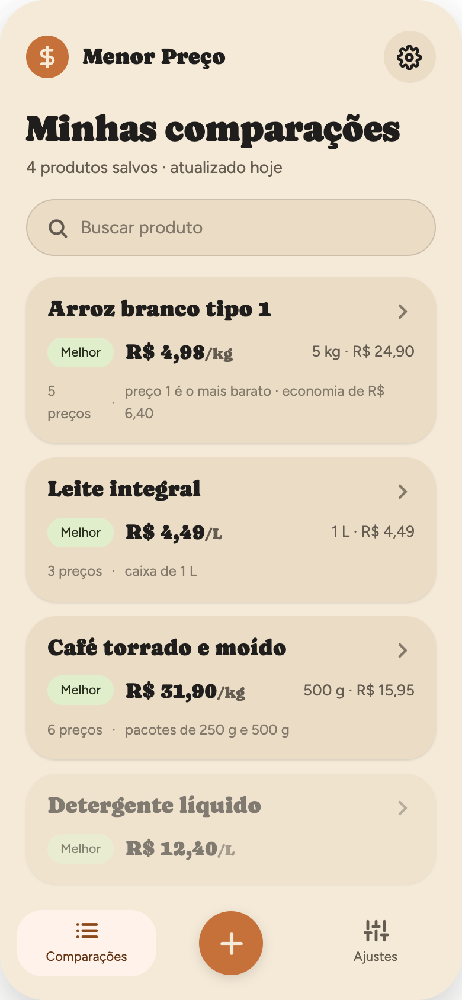
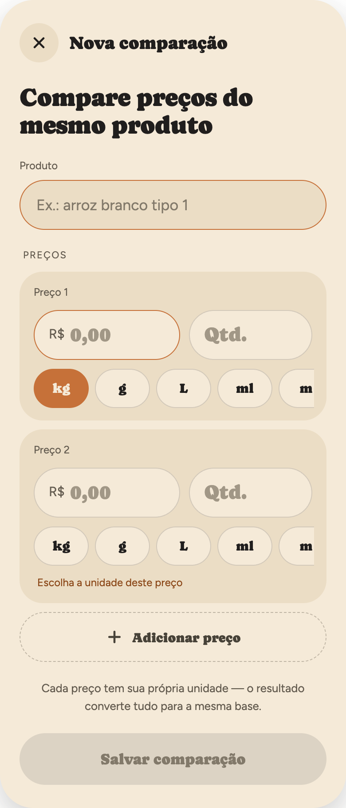
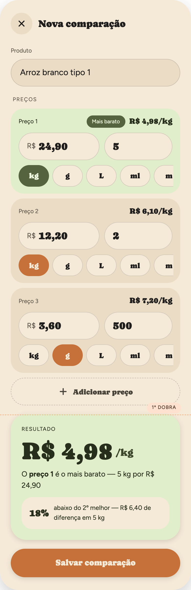

# Compare Price App

### Description

This application contains the idea to show the user which item (product) is cheaper than others.

| Item A          | Item B          |
| --------------- | --------------- |
| Product Name A  | Product Name B  |
| Product UM      | Product UM      |
| Amount A (qty.) | Amount B (qty.) |
| Price A         | Price B         |

#### Example

| Item A      | Item B         |
| ----------- | -------------- |
| Milk da Muu | Product Name B |
| Liter (L)   | Liter (L)      |
| 1           | 12             |
| 4.59 (R$)   | 50.00 (R$)     |

Result is about which is more interested in or relevant in this case is Product B .

### Rules about unit of measure (UM)

Liter compare to Liter
Liter can compare to millilitre (_)
Metre compare to Metres
Metre can compare to Centimetre (_)
Kilogram compare to Kilogram
Kilogram compare to gram (\*)

The rules that have (\*) to need to convert

##### Table about the Unit of Measure

| Measurement Type  | Base Unit | Symbol | Common Prefixes & Multiples                                                |
| ----------------- | --------- | ------ | -------------------------------------------------------------------------- |
| Length            | Metre     | m      | Kilometre (km, 1,000 m), Centimetre (cm, 0.01 m), Millimetre (mm, 0.001 m) |
| Mass / Weight     | Kilogram  | kg     | Gram (g, 0.001 kg), Milligram (mg, 0.000001 kg)                            |
| Volume / Capacity | Litre     | L      | Millilitre (mL, 0.001 L), Cubic Metre (m³,1,000 L)                         |

### Designer

We planed the layout using Claude Designer
The designer was exported to [html](./Designer/html/Comparador%20de%20Preços.dc.html)

### Images

| #HomeScreenEmpty                                         | #HomeScreenFulled                                        |
| -------------------------------------------------------- | -------------------------------------------------------- |
|  |  |

| #NewComparatorEmpty                                                      | #NewComparatorFulled                                                       |
| ------------------------------------------------------------------------ | -------------------------------------------------------------------------- |
|  |  |

#Colors

### Development

- Expo SDK 57 + Expo Router, iOS/Android only. Folder structure and conventions: [README.md](./README.md).
- Expo changes every SDK — check versioned docs (`https://docs.expo.dev/versions/v57.0.0/`) before using an Expo API.
- Install packages with `npx expo install <pkg>`. Run `npm run typecheck` before declaring a task done.
- Never create or edit `ios/` / `android/` by hand — configure native behavior in `app.json`.
